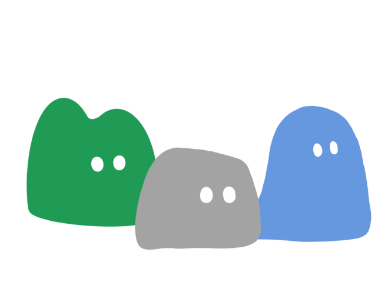

  

# 🌲 깊은산골짜기

- **📅 프로젝트 기간**: 2024.07 - 2024.10 (약 4개월)
- **👥 팀원**: 이주원(팀장), 김하은, 양윤수, 이재빈, 구본헌, 황희태
- **🌐 배포 링크**: [깊은산골짜기](https://djw9hdrinhwdq.cloudfront.net/intro)

## 📌 프로젝트 소개

'깊은산골짜기'는 사용자가 주변 계곡을 탐색하고 리뷰를 남길 수 있는 웹 서비스입니다. 본 프로젝트는 자연 속에서 계곡을 찾고 즐기려는 사람들에게 유용한 정보를 제공하기 위해 기획되었습니다.

이 개인 레포지토리에서는 프로젝트에 기여한 내용을 좀 더 깊이 있게 다루고, 각 작업을 진행하며 겪은 어려움과 그 해결 방법, 그리고 개선한 부분들을 상세히 설명합니다. 또한, 개발 과정에서 얻은 통찰과 앞으로 개선할 부분들에 대해 서술하여 프로젝트와 개인의 성장을 함께 기록하고자 합니다.

## 📝 작성한 페이지

- 🔒 인증/인가 페이지
- 🏠 메인 페이지
- 📝 프로필 수정 페이지
- 🚀 랜딩 페이지
- ✍️ 리뷰 수정 페이지 (다른 팀원이 작성한 페이지 수정)

## 🛠️ 기술 스택

### 기술 스택
 
 
 
 
 
 
 
 
 
 
 
 
 

### 커뮤니케이션
 
 
 

## 🛠️ 개발 과정

### 1. 기획 및 요구사항 분석

- **목표 정의**: '깊은산골짜기'는 사용자가 주변 계곡을 탐색하고 리뷰를 남길 수 있는 서비스를 목표로 함. 계곡과 관련된 정보 및 사용자 경험을 개선하여 유용한 정보를 제공.
- **요구사항 분석**:
  - [요구사항 분석 링크](https://sharp-mare-97e.notion.site/59448b02f36a416d8c81715eda0c1aaf)
  - 사용자의 요구사항을 반영하여 계곡 탐색, 리뷰 작성, 편의시설 검색 등의 기능을 도입.
  - 모바일 사용자가 편리하게 이용할 수 있도록 **아이폰 14 Pro Max를 기준**으로 화면 구성.

### 2. 시스템 설계

- **시스템 아키텍처**: 아키텍처 이미지 링크
- **데이터베이스 설계**: ERD 설계 이미지 링크
- **API 설계**: [API 명세서 링크](https://sharp-mare-97e.notion.site/4f852172b00d413281e3c9074d118d6d?p=83cb7560fc2d475da4e8edc44860bc7a&pm=s)

### 3. 개발 환경 구축

- **기술 스택 선택**: React, TypeScript, Zustand, Tailwind CSS, Chakra UI를 사용하여 프론트엔드를 구현. AWS S3와 CloudFront를 사용해 정적 배포, GitHub Actions로 CI/CD 설정.
- **개발 도구**: 코드 품질 유지를 위해 ESLint와 Prettier, TypeScript를 설정하고, Vite를 사용해 빠른 빌드 환경 구축.
- **프로젝트 구조**: 파일 구조 이미지

### 4. 테스트 및 배포

- **테스트 전략**: Vitest를 사용해 주요 기능에 대한 유닛 테스트 작성. CI 파이프라인에 테스트를 포함하여 코드 변경 시 자동으로 테스트가 실행되도록 설정.
- **CI/CD 설정**: GitHub Actions를 사용해 메인 브랜치에 커밋될 때 자동으로 빌드 및 배포가 이루어지도록 설정. AWS S3와 CloudFront를 통해 정적 파일을 배포하고, CDN 캐시 무효화를 통해 최신 버전을 사용자에게 제공.

### 5. 협업 과정

- **커뮤니케이션 도구**: GitHub Projects, Notion, Discord, Figma를 사용해 팀원 간의 협업을 진행하고, 진행 상황을 투명하게 공유.
- **버전 관리 전략**: Git flow로 main, develop, feature 브랜치를 분리하고, main에서 배포 진행.
- **Git 컨벤션**: 
- **코딩 컨벤션**: ESLint와 Prettier를 사용해 코드 스타일을 통일하고, Airbnb 스타일 가이드를 따름.

---

## Blog
